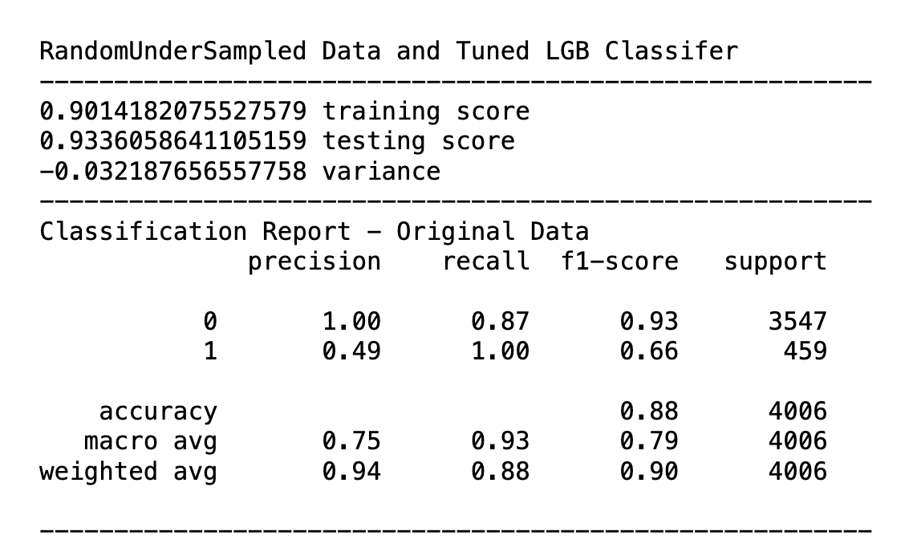
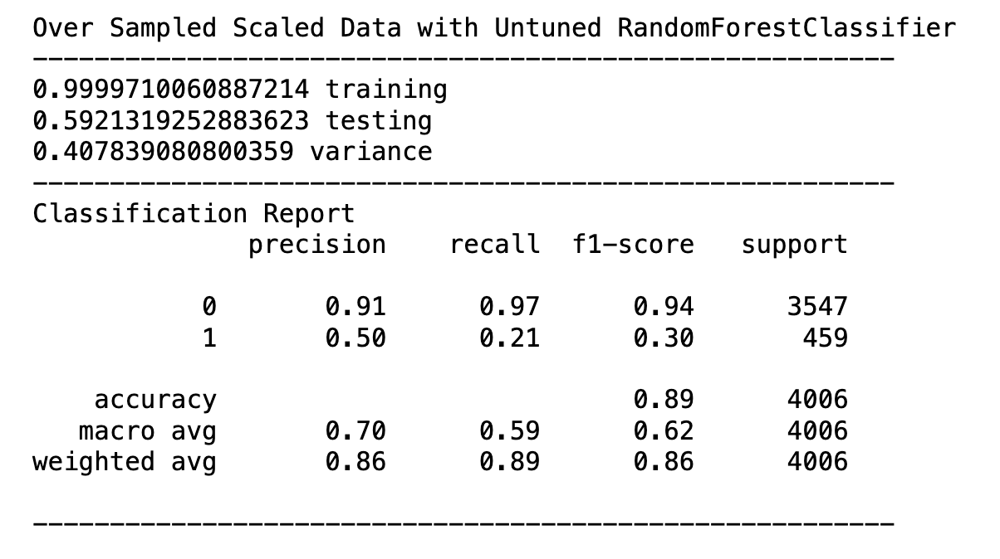

# Group-Project-2

### Contributors: Philip Schrank, Tony Montgomery, & Rob Pavlik

## Summary

This application analyzes the SP-500 index from 1927 to present day, creates a buy signal target variable, and then classifies the success of the buy signal based upon the next day's positive return. The goal was to meet or exceed a 75% balanced accuracy score. 

The best balanced accuracy scores obtained exceeded 93% utilizing either XGBoost or LightBoost with undersampled data and hyperparameter tuning. LightBoost was .1% better than XGBoost in balanced accuracy.

The classification report above shows that the model performs well on the training data and generalizes well on unseen data. The negative variance may indicate a favorable test set or slight underfitting. This would need further examination.

All unprofitable trades were correcly predicted as explained by the 100 % precision score in the majority class with only 13% false negatives.

The precision score on the minority class (buy signal) was only 49% while the recall was 100%. Such scores indicate that all actual buy signals were identified correctly in the testing set, but for every correct idenfitication there was a false positive trade too. 

Given the high number of false positives and the expected transaction costs of actually trading on this signal, it is possible this application does not produce a profitable trading strategy. Further analysis is required. 

The classification report above was earlier in the modelling and the worst peforming combination. It is for comparison to the previous classification report.

## Approach

The approach was a methodical 10-step approach including the tracking of accuracy progression.

1) Create an install package list.
2) Read and load SP-500 index using the YahooFinance (yf) ticker function with period set to max data.
3) Clean data set by dropping unnecessary columns and null values.
4) Perform Feature Engineering:
   - Moving Averages
   - RSI
   - MACD
   - Bollinger Bands
5) Perform Winsorization of data using SciKit Learn's winsorize function with upper and lower settings of .05.
6) Perform Train and Test Splits using SciKit Learn's TimeSeriesSplit function with a setting of 5 folds.
7) Perform Scaling using SciKit Learn's StandardScaler.
8) Perform data sampling using IMBlearn's RandomOverSampling and RandomUnderSampling functions.
9) Perform and display results from various classifications using RandomForestClassifier, XGBoost, and LightBoost. 
10) Perform hyperparameter tuning on XGBoost and LightBoost and reclassify.

## Technical  Indicators
The application utilizes the following technical indicators to enable machine learning and to generate a buy signal:
1. Simple Moving Averages of 10, 20, 30, 50, 100, and 200 days. Moving averages are used to identify trends.
2. Moving Average Convergence Divergence (MACD) shows the relationship between the two exponential moving averages (EMA) of 26-day EMA and 12-day EMA. The signal line is 9 EMA.
3. Relative Strength Indicator which oscillates between zero and 100. Readings above 50 indicate positive and uptrend momentum while readings below 50 show negative and downtrend momentum. Readings above 70 indicate overbought conditions and readings below 30 indicate oversold conditions.
4. Bollinger Bands, developed by John Bollinger, gauge volatility to determine if an asset is over or undervalued. The center line is the 20-day SMA while the upper and lower bands are two standard deviations above and below the mid line. The lines contract when volatility is low and expand when volatility is high.

## Buy Signal Conditions
Buy low and sell high is the goal. This application generates a buy signal target variable of 1 when all the following are true:
1. The Relative Strength Indicator (RSI) is less than 50.
2. The MACD is less than zero.
3. The last closing price is less than the Bollinger mid line.
4. For training, the the next day's percent return must be greater than zero.
When these conditions are false, the target variable is 0.

## Next Steps

The model clearly needs to improve the precision of the minority class. 